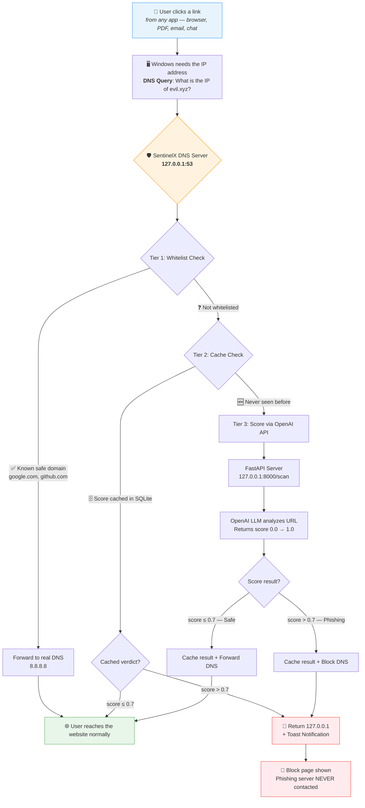
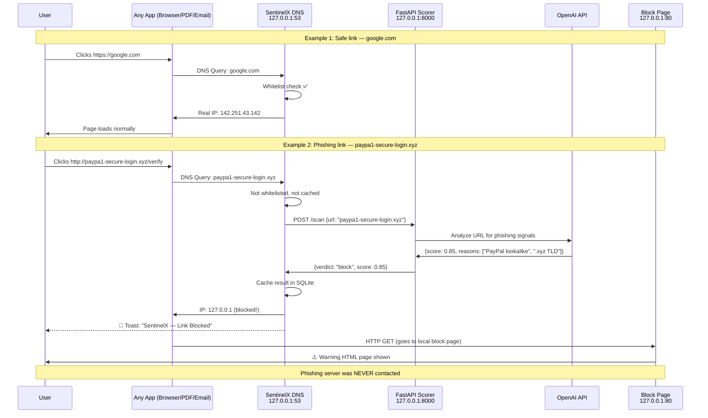
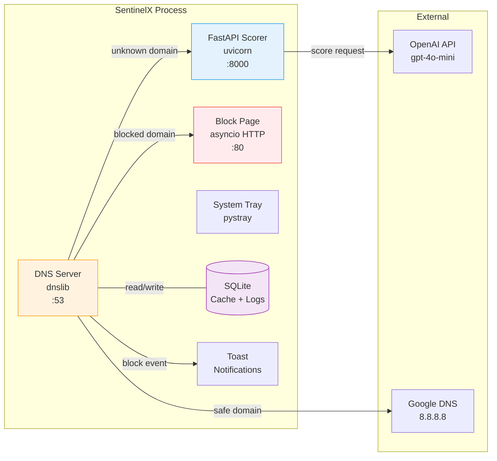

# SentinelX — Phishing Link Interceptor

A DNS-level phishing link interceptor for Windows that catches malicious URLs **from any application** — browser, PDF reader, WhatsApp, Outlook, or any app — before the connection ever reaches the internet.

---

## How It Works



---

## Scoring Flow — Example



---

## Example: What the User Sees

### Safe Link (google.com)
```
Terminal log:
[02:32:53] INFO  dns_server  | ALLOW (whitelist)  google.com

→ Browser loads Google normally. Zero delay.
```

### Phishing Link (arnazon-security.ml)
```
Terminal log:
[02:33:00] WARNING dns_server | BLOCK (cached 0.80)  arnazon-security.ml
[02:33:00] INFO    notify     | Toast SUCCESS for: arnazon-security.ml

→ Browser shows block page (HTTP) or connection error (HTTPS)
→ Windows toast notification pops up
→ Phishing server NEVER receives any traffic
```

---

## Architecture



---

## Project Structure

```
SentinelX-II26/
├── main.py                      # Entry point — launches all components
├── config.py                    # Settings (ports, thresholds, API key)
├── .env                         # OpenAI API key (not committed)
│
├── scorer/
│   ├── server.py                # FastAPI /scan endpoint
│   └── openai_scorer.py         # Calls OpenAI, returns phishing score
│
├── interceptor/
│   ├── dns_server.py            # dnslib UDP server on port 53
│   ├── dns_config.py            # netsh DNS redirect + restore
│   └── cache.py                 # SQLite cache + event logging
│
├── ui/
│   ├── tray_icon.py             # System tray icon (pystray)
│   ├── block_page.py            # Local HTTP server (port 80)
│   ├── warning.html             # Block page HTML
│   └── notify.py                # Windows toast notifications
│
├── data/
│   ├── whitelist.py             # Top domains auto-allowed
│   ├── sentinelx.db             # SQLite database (runtime)
│   └── sentinelx.log            # Full event log
│
├── tests/
│   └── generate_test_pdf.py     # Generate PDF with test links
│
└── utils/
    └── logger.py                # Console + file logging
```

---

## Quick Start

### 1. Setup
```powershell
git clone <repo-url>
cd SentinelX-II26
cp .env.example .env
# Edit .env and add your OpenAI API key
```

### 2. Install Dependencies
```powershell
uv sync
```

### 3. Run (requires admin for DNS redirect)
```powershell
uv run python main.py
```
A UAC prompt will appear — click **Yes**. SentinelX will:
- Start the FastAPI scorer on `127.0.0.1:8000`
- Redirect Windows DNS to `127.0.0.1:53`
- Start the block page server on `127.0.0.1:80`
- Show a system tray icon

### 4. Test
```powershell
# Safe domain — should resolve normally
nslookup google.com 127.0.0.1

# Phishing domain — should return 127.0.0.1 (blocked)
nslookup arnazon-security.ml 127.0.0.1
```

Or generate a test PDF with clickable links:
```powershell
uv run python tests/generate_test_pdf.py
# Open test_links.pdf and click the links
```

### 5. Stop
- Right-click tray icon → **Stop & Restore DNS**
- Or press `Ctrl+C` in the terminal
- DNS is automatically restored

---

## Scoring Thresholds

| Score | Verdict | Action |
|-------|---------|--------|
| 0.0 – 0.3 | `allow` | Forward DNS normally |
| 0.3 – 0.7 | `warn` | Forward DNS (log as suspicious) |
| 0.7 – 1.0 | `block` | Return 127.0.0.1 + toast notification |

---

## Safety

- **DNS always restored on exit** via `atexit` + signal handlers
- **Failsafe**: if the scorer is unreachable, all traffic is ALLOWED (never breaks internet)
- **Emergency DNS restore** (if anything goes wrong):
  ```powershell
  netsh interface ip set dns "Wi-Fi" dhcp
  ipconfig /flushdns
  ```

---

## Tech Stack

| Component | Library |
|-----------|---------|
| DNS Server | `dnslib` |
| Scoring API | `FastAPI` + `uvicorn` |
| LLM Scoring | `openai` (gpt-4o-mini) |
| Cache + Logs | `aiosqlite` (SQLite) |
| System Tray | `pystray` + `Pillow` |
| Notifications | PowerShell balloon tips |
| DNS Redirect | `netsh` (Windows built-in) |
| Package Manager | `uv` |
