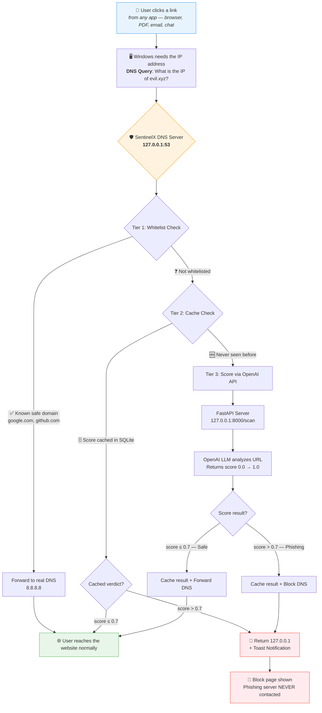
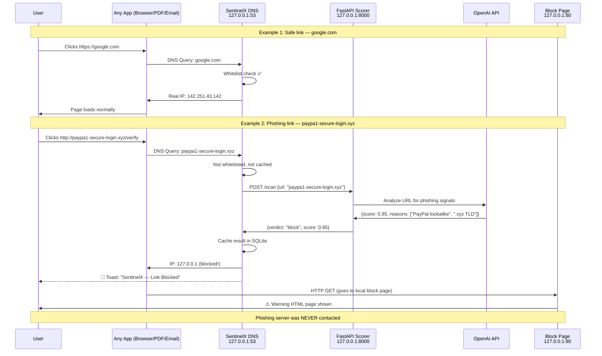
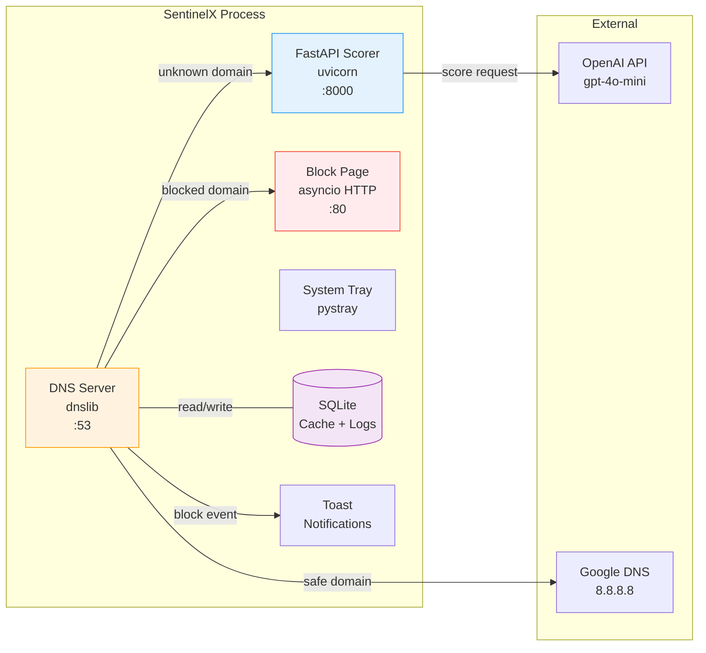
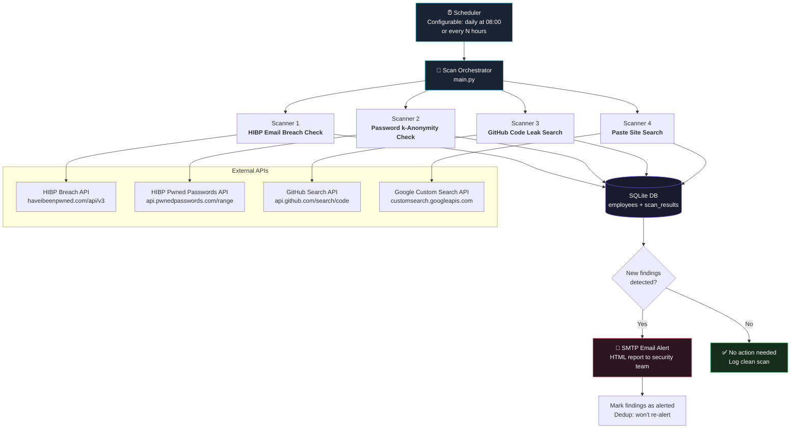
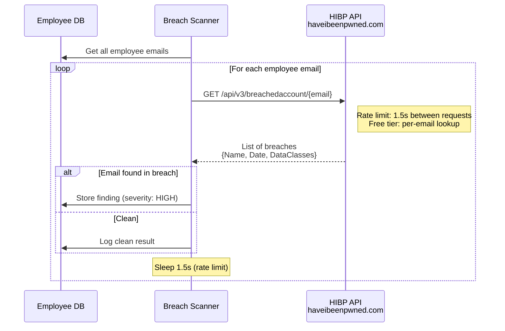
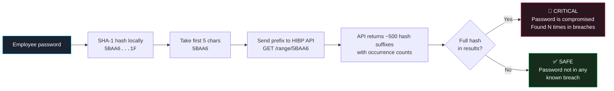
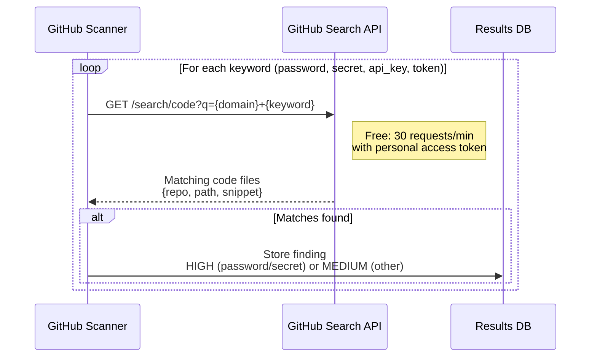
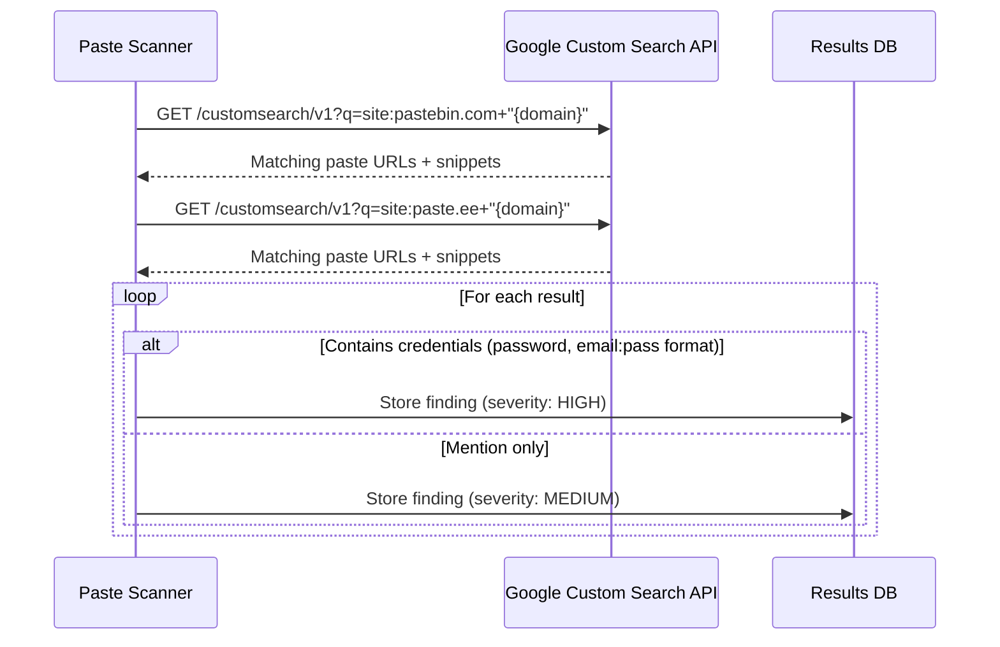
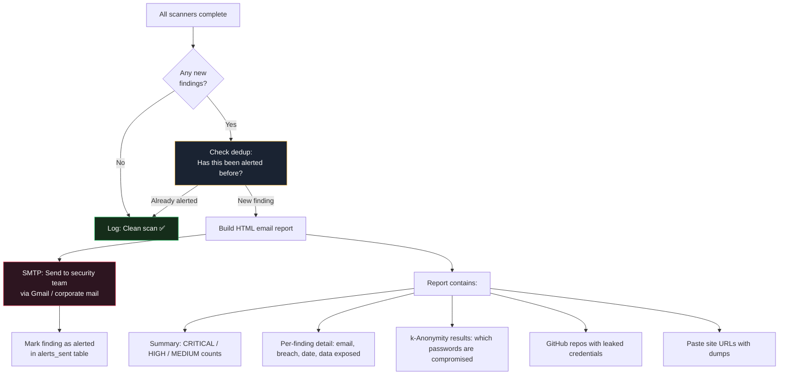
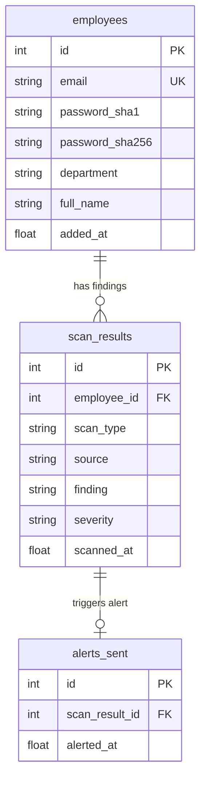

# SentinelX — Phishing Link Interceptor

A DNS-level phishing link interceptor for Windows that catches malicious URLs **from any application** — browser, PDF reader, WhatsApp, Outlook, or any app — before the connection ever reaches the internet.

---

## How It Works



---

## Scoring Flow — Example



---

## Example: What the User Sees

### Safe Link (google.com)
```
Terminal log:
[02:32:53] INFO  dns_server  | ALLOW (whitelist)  google.com

→ Browser loads Google normally. Zero delay.
```

### Phishing Link (arnazon-security.ml)
```
Terminal log:
[02:33:00] WARNING dns_server | BLOCK (cached 0.80)  arnazon-security.ml
[02:33:00] INFO    notify     | Toast SUCCESS for: arnazon-security.ml

→ Browser shows block page (HTTP) or connection error (HTTPS)
→ Windows toast notification pops up
→ Phishing server NEVER receives any traffic
```

---

## Architecture



---

## Project Structure

```
SentinelX-II26/
├── main.py                      # Entry point — launches all components
├── config.py                    # Settings (ports, thresholds, API key)
├── .env                         # OpenAI API key (not committed)
│
├── scorer/
│   ├── server.py                # FastAPI /scan endpoint
│   └── openai_scorer.py         # Calls OpenAI, returns phishing score
│
├── interceptor/
│   ├── dns_server.py            # dnslib UDP server on port 53
│   ├── dns_config.py            # netsh DNS redirect + restore
│   └── cache.py                 # SQLite cache + event logging
│
├── ui/
│   ├── tray_icon.py             # System tray icon (pystray)
│   ├── block_page.py            # Local HTTP server (port 80)
│   ├── warning.html             # Block page HTML
│   └── notify.py                # Windows toast notifications
│
├── data/
│   ├── whitelist.py             # Top domains auto-allowed
│   ├── sentinelx.db             # SQLite database (runtime)
│   └── sentinelx.log            # Full event log
│
├── tests/
│   └── generate_test_pdf.py     # Generate PDF with test links
│
└── utils/
    └── logger.py                # Console + file logging
```

---

## Quick Start

### 1. Setup
```powershell
git clone <repo-url>
cd SentinelX-II26
cp .env.example .env
# Edit .env and add your OpenAI API key
```

### 2. Install Dependencies
```powershell
uv sync
```

### 3. Run (requires admin for DNS redirect)
```powershell
uv run python main.py
```
A UAC prompt will appear — click **Yes**. SentinelX will:
- Start the FastAPI scorer on `127.0.0.1:8000`
- Redirect Windows DNS to `127.0.0.1:53`
- Start the block page server on `127.0.0.1:80`
- Show a system tray icon

### 4. Test
```powershell
# Safe domain — should resolve normally
nslookup google.com 127.0.0.1

# Phishing domain — should return 127.0.0.1 (blocked)
nslookup arnazon-security.ml 127.0.0.1
```

Or generate a test PDF with clickable links:
```powershell
uv run python tests/generate_test_pdf.py
# Open test_links.pdf and click the links
```

### 5. Stop
- Right-click tray icon → **Stop & Restore DNS**
- Or press `Ctrl+C` in the terminal
- DNS is automatically restored

---

## Scoring Thresholds

| Score | Verdict | Action |
|-------|---------|--------|
| 0.0 – 0.3 | `allow` | Forward DNS normally |
| 0.3 – 0.7 | `warn` | Forward DNS (log as suspicious) |
| 0.7 – 1.0 | `block` | Return 127.0.0.1 + toast notification |

---

## Safety

- **DNS always restored on exit** via `atexit` + signal handlers
- **Failsafe**: if the scorer is unreachable, all traffic is ALLOWED (never breaks internet)
- **Emergency DNS restore** (if anything goes wrong):
  ```powershell
  netsh interface ip set dns "Wi-Fi" dhcp
  ipconfig /flushdns
  ```

---

## Tech Stack

| Component | Library |
|-----------|---------|
| DNS Server | `dnslib` |
| Scoring API | `FastAPI` + `uvicorn` |
| LLM Scoring | `openai` (gpt-4o-mini) |
| Cache + Logs | `aiosqlite` (SQLite) |
| System Tray | `pystray` + `Pillow` |
| Notifications | PowerShell balloon tips |
| DNS Redirect | `netsh` (Windows built-in) |
| Package Manager | `uv` |


# SentinelX — Credential Leak Monitor

Continuously watches multiple sources across the open web, paste sites, and breach databases for any mention of an organization's email domain or credentials appearing in leaked data. Alerts the security team the moment a leak is detected — before attackers can exploit it.

> **The average time between a credential breach and its discovery by the victim is 197 days** (IBM Cost of a Data Breach Report). SentinelX reduces that to minutes.

---

## Architecture



---

## How Each Scanner Works

### Scanner 1: HIBP Email Breach Check



**What it detects:** Employee emails appearing in known data breaches (LinkedIn, Adobe, Dropbox, Collection#1, etc.)

**API:** `GET https://haveibeenpwned.com/api/v3/breachedaccount/{email}` — Free for per-email lookups, no API key needed.

---

### Scanner 2: Password k-Anonymity Check (HIBP Pwned Passwords)



**Privacy guarantee:** The actual password or its full hash **never leaves the machine**. Only the first 5 characters of the SHA-1 hash are sent.

**API:** `GET https://api.pwnedpasswords.com/range/{5-char-prefix}` — Completely free, no API key, no rate limit.

---

### Scanner 3: GitHub Code Leak Search



**What it detects:** Developers who accidentally commit credentials, API keys, secrets, or internal URLs to public repos.

**API:** `GET https://api.github.com/search/code?q={query}` — Free with a personal access token (30 searches/minute).

**Keywords searched:** `password`, `secret`, `api_key`, `token`, `credential` + organization domain

---

### Scanner 4: Paste Site Search



**What it detects:** Organization emails or credentials dumped on Pastebin, paste.ee, ghostbin, and similar sites.

**API:** Google Custom Search Engine — Free for 100 queries/day. Requires a Google Cloud API key + Custom Search Engine ID (both free).

---

## Alert & Response Pipeline



**Trigger:** Any new breach, password match, GitHub leak, or paste dump detected.

**Action:** HTML email sent via SMTP (Gmail app password or corporate SMTP) containing full detail with severity color coding.

**Dedup:** Same finding is never alerted twice — tracked in `alerts_sent` table.

---

## Database Schema



---

## Project Structure

```
credential/
├── main.py                  # Entry point — scheduler, scan orchestrator, CLI
├── config.py                # All settings (schedule, SMTP, domain, API keys)
├── generate_reports.py      # Generate HTML dashboard pages
├── .env                     # Secrets (SMTP password, GitHub token, Google API key)
│
├── scanners/
│   ├── breach_scanner.py    # HIBP email breach check
│   ├── password_scanner.py  # HIBP k-Anonymity password check
│   ├── github_scanner.py    # GitHub public repo search
│   └── paste_scanner.py     # Paste site search via Google CSE
│
├── db/
│   ├── models.py            # SQLite schema, CRUD operations
│   └── seed.py              # Seed DB with sample data (prototype mode)
│
├── alerts/
│   └── email_alert.py       # SMTP HTML email sender with dedup
│
├── utils/
│   └── logger.py            # Dual logging (console + file)
│
└── data/
    ├── credleak.db          # SQLite database (runtime)
    ├── credleak.log         # Full scan log
    └── reports/             # Generated HTML pages
        ├── dashboard.html
        ├── employees.html
        ├── leaked_credentials.html
        ├── github_leaks.html
        └── paste_leaks.html
```

---

## Configuration

```python
# config.py
ORG_DOMAIN = "acmecorp.com"           # Domain to monitor
SCAN_SCHEDULE_TIME = "08:00"           # Daily scan time
SCAN_INTERVAL_HOURS = 24               # Or scan every N hours
SCAN_ON_STARTUP = True                 # Scan immediately on launch

# Toggle individual scanners
ENABLE_BREACH_SCAN = True
ENABLE_PASSWORD_SCAN = True
ENABLE_GITHUB_SCAN = True
ENABLE_PASTE_SCAN = True
```

```env
# .env
SMTP_USER=security@company.com
SMTP_PASSWORD=your-app-password
GITHUB_TOKEN=ghp_xxxxxxxxxxxx          # Free personal access token
GOOGLE_API_KEY=AIzaSyxxxxxxxxx          # Free Google Cloud API key
GOOGLE_CSE_ID=xxxxxxxxxx               # Free Custom Search Engine ID
```

---

## Usage

```powershell
# Seed database with sample data (prototype demo)
python main.py --seed

# Run a single scan + send email alert
python main.py

# Run scan without sending email
python main.py --no-email

# Run on schedule (repeat every 24 hours)
python main.py --schedule

# View recent scan results
python main.py --report

# Generate HTML report pages
python generate_reports.py
```

---

## Scoring & Severity

| Severity | Trigger | Action |
|----------|---------|--------|
| **CRITICAL** | Employee password found in breach DB (k-Anonymity match) | Immediate alert — force password reset |
| **HIGH** | Email in breach with password exposed / GitHub credential leak / Paste with credentials | Alert — investigate and rotate credentials |
| **MEDIUM** | Email in breach without password / Paste mention / GitHub non-credential keyword | Alert — monitor |
| **LOW** | Domain mention without credentials | Log only |

---

## API Costs

| Source | Cost | Rate Limit |
|--------|------|-----------|
| HIBP Pwned Passwords (k-Anonymity) | **Free** | Unlimited |
| HIBP Breach Check (per email) | **Free** | 1 request / 1.5 seconds |
| GitHub Search API | **Free** (with token) | 30 requests / minute |
| Google Custom Search | **Free** (100/day) | 100 queries / day |
| SMTP (Gmail) | **Free** | 500 emails / day |

**Total cost: $0/month** for all APIs.

---

## Security Considerations

- **Passwords are never stored in plaintext** — only SHA-1 and SHA-256 hashes
- **k-Anonymity** ensures the actual password or full hash never leaves the machine
- **SMTP credentials** stored in `.env` file (never committed to git)
- **Alert deduplication** prevents alert fatigue — same finding is never reported twice
- **Failsafe**: if any scanner or API fails, other scanners continue independently
